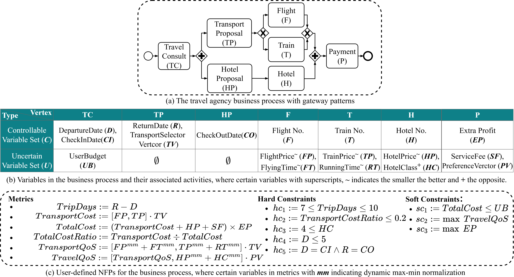

## Overview  

This repository hosts the prototype code and supplementary materials (a separate PDF) for the submitted paper:  
> **P-MDP: A Framework to Optimize NFPs of Business Processes in Uncertain Environments** (authors anonymized for double-blind review).  

The supplementary materials include in-depth technical specifications and formal mathematical definitions omitted from the main paper, providing essential details for implementing and validating the P-MDP (Process-aware Markov Decision Process) framework.  


## Datasets  

To support experimentation and validation of the P-MDP framework, three datasets are included or referenced in this repository:  

* [WS-DREAM QoS Dataset 2](./Datasets/wsdream/): is orginal from https://wsdream.github.io what includes real-world QoS evaluation results from 339 users on 5,825 Web services.
* [QWS Datasets](./Datasets/QWS/): is orginal from https://qwsdata.github.io what includes a set of 2,507 web services and their Quality of Web Service (QWS) measurements. 
* [TravelAgencyNFPs DataSet](./Datasets/TravelAgencyNFPsDataset/): A synthetic dataset by the authors (explained in the paper) for testing NFP modeling with temporal (e.g., weekend premiums), commercial (e.g., bundled discounts), and star-price correlated features. Covers 15 days of 20 flights, 40 trains, and 60 hotels (100 records each for uncertainty simulation).


## Samples of Business Processes with User-defined NFPs

A set of BPMN business processes is included for testing, with details below:  

### Travel Agency  
The running example process, featuring gateways (parallel/exclusive) and user-defined functional/non-functional properties (FPs/NFPs). It models travel arrangement processes (e.g., booking flights, hotels) with runtime uncertainties (e.g., price fluctuations, transit delays).  

  


### Sequence CSSC-MDP  
Processes prefixed with `CSSC*` (stored in `./BPMN_Models/Benchmark_experiment_models`) are serial processes designed for benchmark comparisons with CSSC-MDP. They consist of sequential abstract services, aligning with the setup of prior MDP-based service composition frameworks.  


### QWS Dataset Processes  
Processes in `./BPMN_Models/QWS/` are designed to evaluate complex user-defined NFPs supported by P-MDP, using the QWS Datasets (2,507 web services with 8 core Quality of Service (QoS) measurements). These sequential workflows focus specifically on advancing beyond traditional MDP limitations in modeling complex metrics:  

- **Standard QoS Metrics** (with basic aggregations):  
  - $RT$ (Response Time), $LA$ (Latency), $CO$ (Compliance), $BP$ (Best Practices) – aggregated via summation ($\sum$)  
  - $AV$ (Availability), $SU$ (Success Rate), $RE$ (Reliability) – aggregated via product ($\prod$)  
  - $TP$ (Throughput) – aggregated via minimum ($\min$)  

- **Custom User-Defined KPIs** (with complex operators, unattainable via traditional MDP methods):  
  - $LTS$ (Latency-Throughput Score): $LTS = \frac{TP}{\max(1-RT,\,1-LA)+\epsilon}$  
  - $SHI$ (Service Health Index): $SHI = \sqrt{Stability \times Compliance}$, where:  
    - $Stability = \sqrt[10]{AV} \times \sqrt[10]{SU} \times \sqrt[10]{RE}$  
    - $Compliance = \frac{CO+BP}{2}$  

- **Constraints**:  
  - Hard constraint: $SHI > 0.6$  
  - Soft constraints: $LTS > 2.0$ and maximization of $SHI$  

These processes demonstrate P-MDP’s unique capability to handle sophisticated, user-defined NFPs within business processes, surpassing traditional frameworks limited to basic metric aggregations.  


## Setup Environment  

The prototype is built with Python 3.11 (compatibility with other versions is untested but may work). Follow these steps to set up the environment using Conda:  


1. **Create the environment**  
   Run the command below to create a Conda environment and install all dependencies (specified in `pmdp_conda.yml`):  
   ```bash
   conda env create -f pmdp_conda.yml
   ```  


2. **Activate the environment**  
   Once created, activate the environment with:  
   ```bash
   conda activate pmdp_env
   ```  
   *Note: The environment name (`pmdp_env`) is defined in `pmdp_conda.yml` under the `name:` field. If your YAML file uses a different name (e.g., `pmdp`), replace `pmdp_env` with that name.*  


After activation, you’re ready to run experiments.

## Experiments


### How to Run

The main script supports flexible execution via command-line arguments, with configurations stored in `src/training_configs/` (including pre-defined configs for paper experiments):

| Execution Mode | Command | Description |
|----------------|---------|-------------|
| Direct run | `python src/pmdp/Optimize_NFPs_in_PMDP.py` | Skips config reading, runs main( ) directly |
| Default config | `python src/pmdp/Optimize_NFPs_in_PMDP.py pmdp` or `python src/pmdp/Optimize_NFPs_in_PMDP.py cssc`  | A defualt config example in `training_configs/`: <br>- PMDP for running example: `pmdp_default_config.json` <br>- CSSC-MDP: `wsdream_cssc_mdp_10AS_config.json` |
| Custom config | `python src/pmdp/Optimize_NFPs_in_PMDP.py pmdp config_name.json` or `python src/pmdp/Optimize_NFPs_in_PMDP.py cssc config_name.json` | Runs with a specified config file (from `training_configs/` or custom) |


### 1. Benchmark Comparison with CSSC-MDP  

We compare P-MDP with CSSC-MDP (a state-of-the-art constraint-satisfied service composition framework) using identical functional/non-functional properties (FPs/NFPs) for fairness. Both frameworks use the **WS-DREAM QoS Dataset 2** (339 users, 5,825 web services grouped into 50 abstract services with 116 candidates each), where QoS records (response time, throughput) simulate runtime uncertainty.  

NFPs are defined as:  
- Response time: \(rt = \sum_{i=1}^m rt_i < 22\,\text{s}\)  
- Throughput: \(tp = \min_i(tp_i) > 13\,\text{Kbps}\)  

*(Note: Prior work, including CSSC-MDP, focuses on serial processes; flow diagrams are omitted here.)*  


Note: Run experiments individually (not in bulk) due to resource requirements:  
```bash
# CSSC-MDP (10/30/50 abstract services)
python src/pmdp/Optimize_NFPs_in_PMDP.py cssc wsdream_cssc_mdp_10AS_config.json
python src/pmdp/Optimize_NFPs_in_PMDP.py cssc wsdream_cssc_mdp_30AS_config.json
python src/pmdp/Optimize_NFPs_in_PMDP.py cssc wsdream_cssc_mdp_50AS_config.json

# P-MDP (matching abstract services)
python src/pmdp/Optimize_NFPs_in_PMDP.py pmdp wsdream_pmdp_10AS_config.json
python src/pmdp/Optimize_NFPs_in_PMDP.py pmdp wsdream_pmdp_30AS_config.json
python src/pmdp/Optimize_NFPs_in_PMDP.py pmdp wsdream_pmdp_50AS_config.json
```


### Visualizing Results

#### Where Results Are Stored
Experimental results (success rates, rewards, training times, etc.) from the commands above are saved in the `src/training_records/` folder as `.txt` files (structured as 2D lists for easy loading).


### Visualization Tool

#### Location
Core visualization script:  
`src/experiments_visualizer/Experiments.py`  
Generates all paper figures (Fig.5a-b, Fig.6a-d, Fig.7a-b) using experiment data.


#### Quick Start
1. **Check Data**  
   Precomputed results are already in `Experiment_results/`, including:  
   - Benchmark comparisons (P-MDP vs CSSC-MDP on WSDREAM)  
   - Parameter sensitivity data (learning rate α, PER ω)  
   - Training time vs service counts  
   - Rewards for QWS and TravelAgency datasets  

2. **Run the Script**  
   Generate all plots automatically:  
   ```bash
   python src/experiments_visualizer/Experiments.py
   ```

3. **Customization (Optional)**  
   Modify `Experiments.py` to adjust:  
   - File paths in `path_params` (point to your results)  
   - Labels, plot modes, or zoom ranges in `plot_Experiment_pictures()`  
   - Save plots by adding `plt.savefig("filename.png")`  

Plots will display automatically; adjust parameters to refine visualizations.

### 2. Framework Features Evaluation for User-defined NFPs with Uncertainties  

This section focuses on experiments using the business processes introduced in [Samples of Business Processes](#samples-of-business-processes), testing P-MDP’s unique capability to model complex user-defined NFPs and runtime uncertainties.  


#### Using QWS Dataset  
Builds on the **QWS Dataset Processes** (detailed in [Samples](#samples-of-business-processes)), evaluating P-MDP’s support for complex NFPs beyond traditional MDP frameworks.  

Run the experiment with:  
```bash
python src/pmdp/Optimize_NFPs_in_PMDP.py pmdp QWS_pmdp_config.json
```  


#### Using Travel Agency Synthetic Data  
Leverages the **Travel Agency process** (visualized in [Samples](#samples-of-business-processes)) to test handling of gateway-induced dependencies and dynamic uncertainties (e.g., price fluctuations, temporal constraints).  

For full specifications of FPs, hard/soft constraints, and uncertainty models, refer to the paper (Sect. 4.2).  

Run the experiment with:  
```bash
python src/pmdp/Optimize_NFPs_in_PMDP.py pmdp TravelAgency_pmdp_config.json
```  


Both experiments validate P-MDP’s flexibility in modeling user-defined NFPs and adapting to runtime uncertainties, as detailed in the paper.


## Modeling NFPs with BPMN Annotations  

Use BPMN annotations to define NFPs (metrics, constraints, variables) for your process. Below is the core syntax, including supported operators and examples:  


### 1. User-Defined Metrics (KPIs)  
Define custom key performance indicators with mathematical expressions.  

- **Annotation Format**: `KPIs::kpi1=expression|kpi2=expression|...`  
- **Rules**:  
  - Prefix with `KPIs::`  
  - Separate metrics with `|`  
  - Reference variables (e.g., `R`, `D`) or other KPIs (e.g., `TransportCost`).  
- **Supported Operators**:  
  - Arithmetic: `+` (addition), `-` (subtraction), `\times` (multiplication), `\div` (division)  
  - Vector operations: `[a,b,c]` (vector), `⋅` (dot product, e.g., `[FP,TP]⋅TV`)  
  - Functions:  
    - `\mm(x)`: Dynamic max-min normalization (e.g., `\mm(FC)`)  
    - `\RB[set]`: Select maximum from a set (e.g., `\RB[1,3,5]`)  
    - `\LB[set]`: Select minimum from a set (e.g., `\LB[2,4,6]`)  
    - `\log(x)`, `\abs(x)`: Logarithm and absolute value  
    - `\sqrt(x)`: Square root (e.g., `SHI = \sqrt{Stability \times Compliance}`), or `\sqrt[n]{x}` for n-th root  
  - Grouping: `(` and `)` for order of operations  

- **Example**:  
  `KPIs::TripDays=R-D|TransportCost=[\mm(FP),\mm(TP)]⋅TV|TotalCost=\sqrt(TransportCost+HC+SF)\times EP`  
- **Attachment**: Link to a `DataObjectReference` named `KPIs`, then connect to the `StartEvent`.  


### 2. Constraints  
#### Hard Constraints (Must be satisfied)  
- **Annotation Format**: `HC::hc1#weight:condition|hc2#weight:condition|...`  
- **Rules**:  
  - Prefix with `HC::`  
  - Each constraint has a name (e.g., `hc1`), weight (`#0.2` for importance), and condition.  
- **Supported Operators**:  
  - Comparisons: `>`, `≥` (`\ge`), `<`, `≤` (`\le`), `=`, `≠` (`\ne`)  
  - Logic: `∧` (`\wedge` for AND), `∨` (`\vee` for OR), `!` (NOT)  

- **Example**:  
  `HC::hc1#0.2:7≤TripDays∧TripDays≤10|hc2#0.2:TotalCostRatio≤0.2|hc3#0.2:D≤5`  
- **Attachment**: Link to a `DataObjectReference` named `HardConstraints`.  


#### Soft Constraints (To be optimized)  
- **Annotation Format**: `SC::sc1#weight:condition|sc2#weight:optimization|...`  
- **Rules**:  
  - Prefix with `SC::`  
  - Supports conditions (same as hard constraints) and optimization targets.  
- **Supported Operators**:  
  - Same comparisons/logic as hard constraints  
  - Optimization: `\max metric` (maximize), `\min metric` (minimize)  

- **Example**:  
  `SC::sc1#0.33:TotalCost≤UB|sc2#0.33:\max(TravelQoS)|sc3#0.34:\min(TP)`  
- **Attachment**: Link to a `DataObjectReference` named `SoftConstraints`.  


### 3. Variables (Controllable/Uncontrollable)  
Define variables influencing metrics/constraints, including controllable choices and uncertain factors.  

- **Annotation Format**: `C={var1:{[val1],[val2],...}|var2:{...}}||U={var#type:{(val,prob)|(val,unknown)}|...}`  
- **Rules**:  
  - `C=` for controllable variables (values you can select):  
    - List individual values as `[val1],[val2],...` (not vectors).  
  - `U=` for uncontrollable variables (uncertainty):  
    - Define probability distributions: `(value, probability)` (e.g., `([2000],0.2)`).  
    - Use `(value, unknown)` for undefined distributions.  
    - Add type tags (e.g., `#positive` for non-negative values).  

- **Example**:  
  `C={D:{[0],[1],[2],...,[15]}|CI:{[0],[1],...,[15]}}||U={UB#positive:{([2000],0.2),([4000],0.35)}|FP#negative:{([100],unknown),([200],unknown)}}`  
- **Attachment**: Link directly to the activity (task) where the variables apply.  


### Procedures  
1. Add annotations using the syntax above.  
2. Attach metrics/constraints to `DataObjectReference` objects (named `KPIs`, `HardConstraints`, `SoftConstraints`).  
3. Connect these objects to the process (e.g., `StartEvent` for metrics).  
4. Link variable annotations to relevant activities.  

For a complete list of supported operators, operator behavior, and guidance on extending the operator set, refer to:
- The python file for [core operator definitions](./src/pmdp/KPIs_Constraints_Operators_Parse_Evaluation.py)  
- The step-by-step extension guide for [how to add new operators to P-MDP](./src/utilities/README4PyFiles/README_4_How_to_Add_New_Operators_to_P-MDP.md)  
- The paper for underlying theoretical details.
